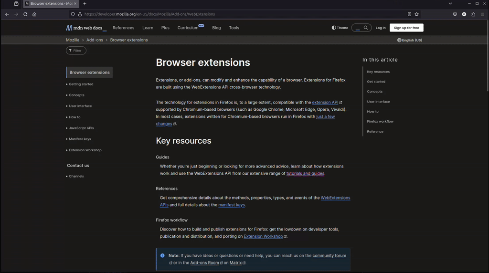
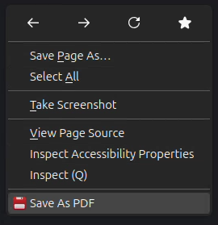
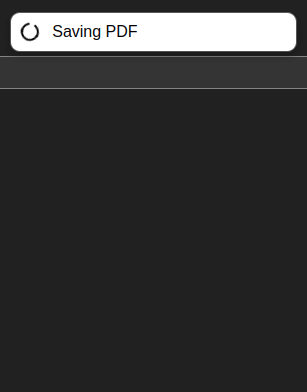
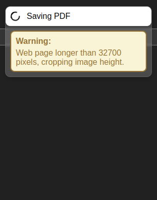
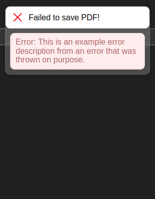
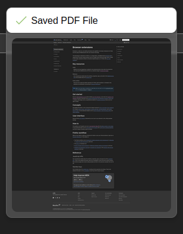

<h1 style="text-align: center">

    

Save PDF
</h1>

A browser extension that allows users to take a full-page screenshot of a web-page and save it as a PDF file. 
It also adds the text content of the HTML page to the pdf file, to make the PDF file searchable.

## Gallery

**Example** Usage:

Associated **Context Menu** Option:

**Notication** Feedback Types:
Processing Feedback |  Warning Feedback |  Failure Feedback |  Success Feedback
:-------------------------:|:-------------------------:|:-------------------------:|:-------------------------:
  |   |   |  

## Usage
1) Open any web-page
2) Right click to open the Context Menu
3) Click on `Save as PDF`

- A notification will show up in the top right of the web page, giving real-time user feedback:
    - Shows what is currently being worked on during operation (with loading icon).
    - Upon non-critical issued during processing, a warning will be displayed.
    - If the PDF was saved succesfully, the screenshot that was taken will be visible for verification.
    - If the PDF failed to save, an error message will be visible.
- After a short while (few seconds), the notification will automatically be removed again.

## Install
Currently, this Web Extension is only available on Firefox.  
You can install it via Firefox Add-ons.

## About
### Known Issues
- Sticky elements at the bottom of a web-page (e.g. cookie banners) are best removed by user before the file is saved as PDF, otherwise these might cover part of the web-page content.
- Some web-pages (e.g. Youtube, etc.) dynamically load content (e.g., images, grid-elements, etc.), only loading the content if it enters the viewport. This results in artifacts in the saved screenshot.
- Some web-pages only save the current viewport, even when a full-screen screenshot is taken.

### Future Updates
- Adding the option to only take a PDF screenshot of the current viewport.
- To deal with dynamic loading, add the option to take a full-page screenshot by stitching together multiple partial screenshots (possibly with automatic scrolling).
- Add the option to automatically merge different screenshots, accross different web-pages.

### Third-Party Libraries
This application comes with a distributed version of the following libraries (to allow it to work fully offline):
| Library Name  | Explanation   | Version       | License       |
| ------------- | ------------- | ------------- | ------------- |
| [jsPDF](https://github.com/parallax/jsPDF) | PDF Document creation from JavaScript | v3.0.0 | MIT License |

### License
[MIT License](./LICENSE.txt)

